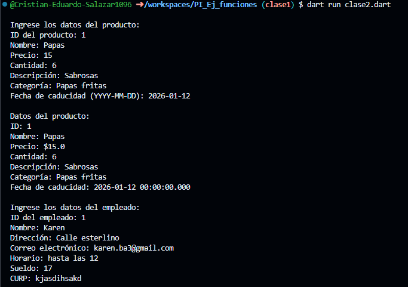
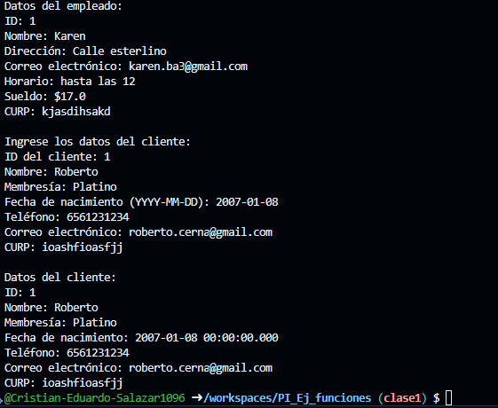

Clase 2 - Tablas

- crear una clase Producto con atributos(id_producto,nombre,precio,cantidad,descripcion,categoria,fecha de caducidad), una función captura() y otra mostrar datos(), crear la instancia utilizar los atributos y llamadas a funciones lenguaje dart

- crear una clase Empleado con atributos(id_empleado,nombre,direccion,correo,horario,sueldo,curp), una función captura() y otra mostrar datos(), crear la instancia utilizar los atributos y llamadas a funciones lenguaje dart

- crear una clase Cliente con atributos(id_cliente, nombre, membresia, fecha de nacimiento,telefono,correo,curp), una función captura() y otra mostrar datos(), crear la instancia utilizar los atributos y llamadas a funciones lenguaje dart

