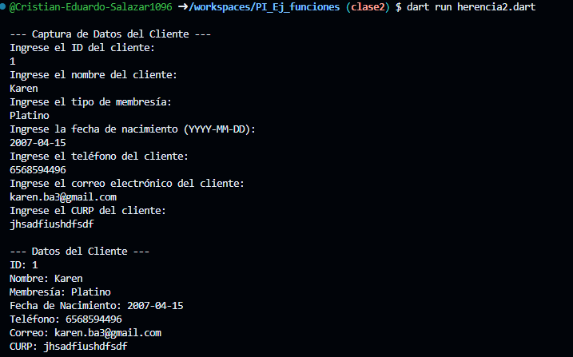
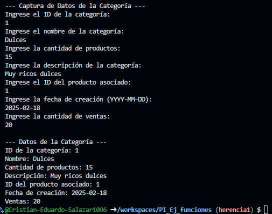

- Crear la clase Categoria con los atributos (id_categoria, nombre, Cantidad de producto, descripcion, id_producto, fecha de creacion, ventas) con una funcion capturadatos(), con interaccion de interfaz de usuario. crear la clase DatosCategoria con herencia Categoria y una funcion mostrarDatos(). lenguaje dart

- Crear la clase Cliente con los atributos (id_cliente,nombre,membresia,fecha de nacimiento, telefono, correo,curp) con una funcion capturadatos(), con interaccion de interfaz de usuario. crear la clase DatosCliente con herencia Cliente y una funcion mostrarDatos(). lenguaje dart

