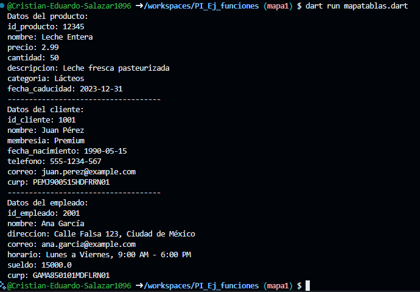

Mapa Tablas

- crear map<string, dinamyc> Producto con los siguientes key, id_producto, nombre, precio, cantidad, descripcion, categoria y fecha de caducidad. y mostrar los datos con un foreach, lenguaje dart

- crear map<string, dinamyc> Cliente con los siguientes key, id_cliente, nombre, membresia, fecha de nacimiento, Telefono, correo y curp. y mostrar los datos con un foreach, lenguaje dart

- crear map<string, dinamyc> Empleado con los siguientes key, id_empleado, nombre, Direccion, correo, Horario, sueldo y curp. y mostrar los datos con un foreach, lenguaje dart

